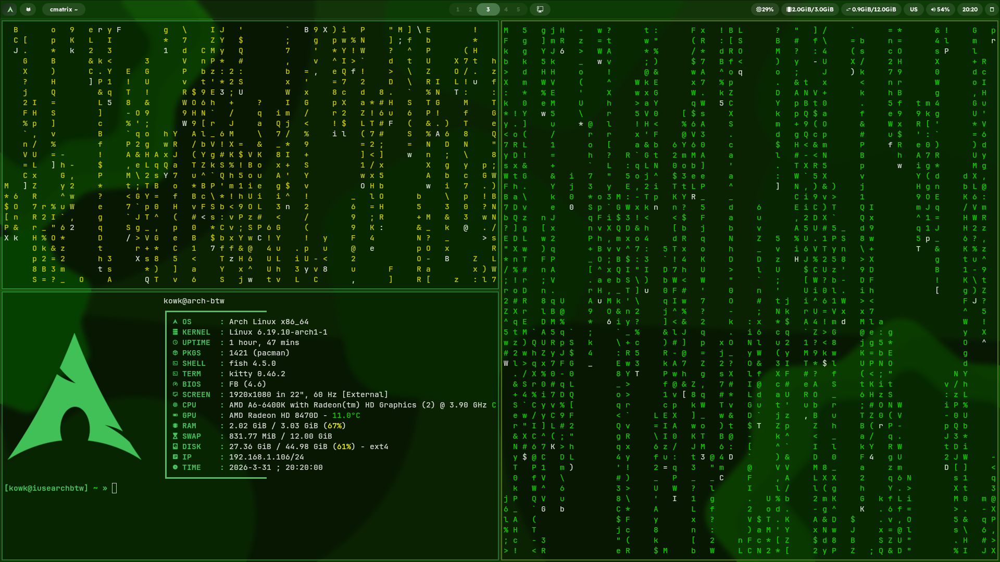
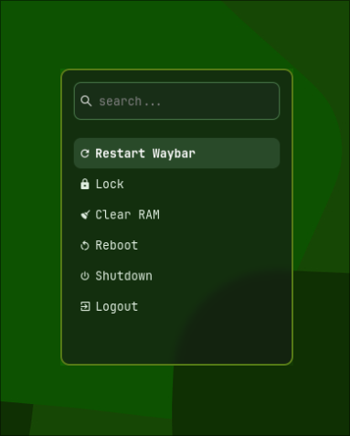
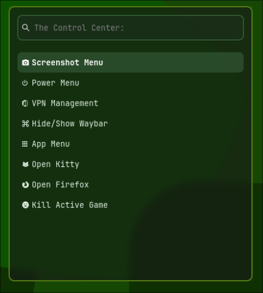
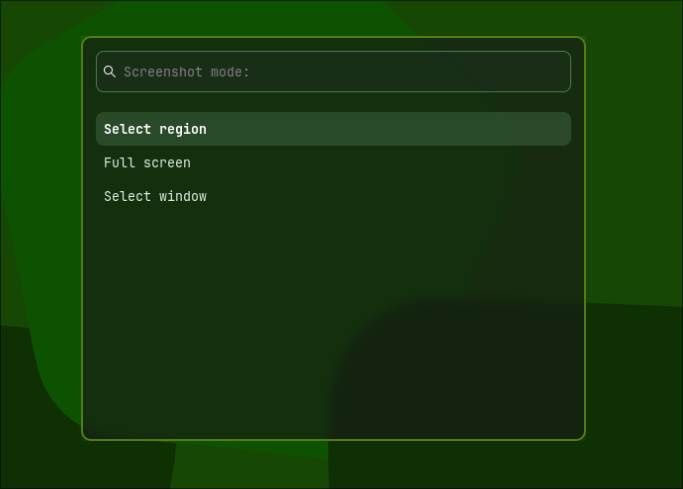

# 🇷🇺 Russian version
## Зелёные дотфайлы для [hyprland](https://hypr.land)
### ✨ Оссобености
Скрипты(.config/kripts) : Кастомные скрипты(кроме zoom.sh) нужны чтобы все было идеально.
Опен-сурс: это я не знаю причем но типо это опенсурс вау круто без вирусов.
Зелёный стиль: Изначально я хотел типо Material 3 You стиль, но получилось это.
Поддержка: тоже не знаю причем тут это но мой [дискорд](https://discord.com/users/1286969036780998667)
Подходит для старых ПК: у меня старый компьютер на нем 3гб опры и AMD A6400K и оно летает, 0.7гб если ничего не открывать
Хорошее вики: для меня оно хорошее

### ⌨️ Бинды (Super = Виндовс)
    Super + Enter(либо Q) = Открывает терминал(kitty)
    Super + W = Открывает браузер(firefox)
    Super + E = Открывает дольфин(файловый менеджер)
    Super + V = Плавающие окна
    Super + C / Alt + F4 = закрывает окно
    Alt + Enter = принудительно фуллскринит приложение

    Super + End = Центр управления(Wireguard(впн), Открыть браузер, Открыть kitty, повер меню, апп меню, тоггл вейбара, закрыть активную игру)
    Super = Апп меню
    Super + Shift + R = Тоггл вейбара
    Super + M = Power Menu
    
    Super + 1-5 = Зайти на десктоп 1-5
    Super + Alt + 1-5 = Перекинуть текущее окно(выделенное) на десктоп 1-5

### 📥 Установка
1. Скопируйте репозиторий через `git clone https://github.com/xDeadForMeLife/hyprfiles`

Скачайте зависимости
```
sudo pacman -S hyprland hyprlock hypridle waybar wofi mako kitty dolphin \
grim slurp wl-clipboard jq wireguard-tools network-manager-applet \
playerctl fastfetch libnotify ttf-jetbrains-mono-nerd
```
3. Зайдите в папку с дотфайлами и напишите в терминал

Для бекапа
```
mv ~/.config/hypr ~/dotfiles_backup/ 2>/dev/null
mv ~/.config/waybar ~/dotfiles_backup/ 2>/dev/null
mv ~/.config/wofi ~/dotfiles_backup/ 2>/dev/null
mv ~/.config/mako ~/dotfiles_backup/ 2>/dev/null
```

Перемещение дотфайлов в нужную папку
`cp * ~/.config`
4. Зайдите в сессию с hyprland
5. должно все работать удачи 

---
# 🇺🇸 English version

## Green dotfiles for Hyprland
### ✨ Features

Custom Scripts: Located in .config/kripts (except for zoom.sh). These scripts are the brain of the setup, making everything work perfectly.
Open Source: Fully transparent, me-driven, and virus-free.
Green Aesthetic: Originally inspired by Material 3 You, it evolved into this unique forest-green theme.
    Support: If you need help, catch me on Discord.
    Low-End PC Friendly: Tested on an old AMD A6400K with 3GB RAM. It flies! Idle RAM usage is only 0.7GB.
    Solid Wiki: A detailed and easy-to-follow wiki for all your needs.
### ⌨️ Keybindings (Super = Windows Key)
    Super + Enter (or Q) = Open Terminal (Kitty)
    Super + W = Open Browser (Firefox)
    Super + E = Open File Manager (Dolphin)
    Super + V = Toggle Floating Mode
    Super + C / Alt + F4 = Close Active Window
    Alt + Enter = Force Fullscreen
    
    Super + End = Control Center (Wireguard VPN, Browser, Kitty, Power Menu, App Menu, Toggle Waybar, Kill Active Game)
    Super = App Menu
    Super + Shift + R = Restart Waybar
    Super + M = Power Menu
    
    Super + 1-5 = Switches desktop to 1-5
    Super + Alt + 1-5 = Move current window to desktop 1-5

### 📥 Installation
Clone the repository with `git clone https://github.com/xDeadForMeLife/hyprfiles`
First you need to cd into your new folder that you git cloned
1. Install Dependencies:
```
sudo pacman -S hyprland hyprlock hypridle waybar wofi mako kitty dolphin \
    grim slurp wl-clipboard jq wireguard-tools network-manager-applet \
    playerctl fastfetch libnotify ttf-jetbrains-mono-nerd
```
2. Backup your current configs: 
```
mkdir ~/dotfiles_backup
mv ~/.config/hypr ~/dotfiles_backup/ 2>/dev/null
mv ~/.config/waybar ~/dotfiles_backup/ 2>/dev/null
mv ~/.config/wofi ~/dotfiles_backup/ 2>/dev/null
mv ~/.config/mako ~/dotfiles_backup/ 2>/dev/null
mv ~/.config/fastfetch ~dotfiles_backup 2>/dev/null
```
3. Move dotfiles to the config folder:
`cp -r * ~/.config/`
4. Launch Hyprland session. 
5. Everything should be working now. Good luck!

# Screenshots/Скриншоты





