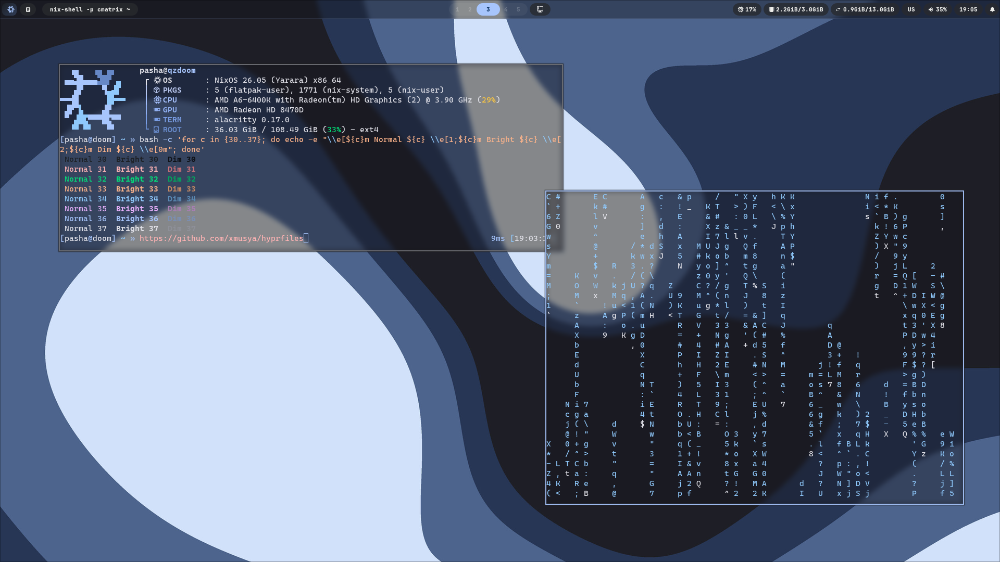
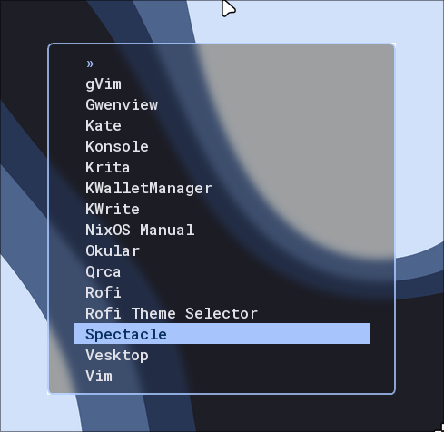
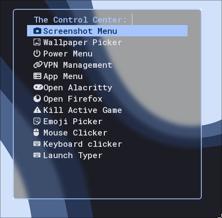
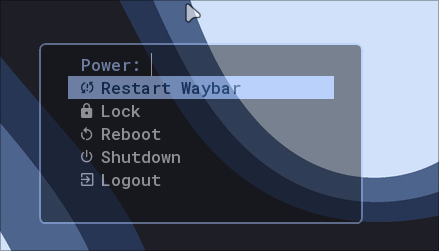
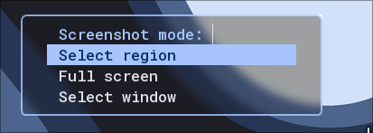

# 🌿 hyprfiles (LUA)

Мои dotfiles для [Hyprland](https://hypr.land) — зелёная тема, конфиг на **Lua**, без жира.

## ✨ Фичи

- **Конфиг Hyprland на Lua** — `hyprland.lua` + модули `monitors.lua`, `keybinds.lua`, `visuals.lua`
- **Бинды по keycode** — работают на любой раскладке (ru/en), не ломаются при переключении языка
- **Лаунчер** — fuzzel
- **Уведомления** — swaync (тёмный control center со скруглениями)
- **Панель** — waybar (pill-стиль, рабочие столы 1–5, трей, клипборд, звук, время)
- **Экран блокировки** — hyprlock с XRAY-эффектом на поле ввода
- **Обои** — `awww` демон + пикер обоев, который заодно обновляет фон hyprlock
- **Control Center** — единое меню на fuzzel: скриншоты, обои, power menu, VPN, приложения
- **Зум курсора** — колесо мыши с `Super` (взято из [end-4/dots-hyprland](https://github.com/end-4/dots-hyprland))
- **Клипборд** — cliphist + fuzzel (иконка в waybar)
- **Лёгкий** — без KDE-демонов в рантайме, подходит для слабых ПК

## 📁 Структура

```
hyprfilesLUA
├── hypr/
│   ├── hyprland.lua          # точка входа (env, базовый конфиг, автозапуск)
│   ├── monitors.lua          # мониторы и воркспейсы
│   ├── keybinds.lua          # все хоткеи
│   ├── keycodes.lua          # keycode-константы (A-Z, цифры, мышь)
│   ├── visuals.lua           # анимации, правила слоёв (blur)
│   ├── hyprlock.conf         # экран блокировки
│   ├── hyprlock/colors.conf  # цвета для hyprlock
│   ├── hypridle.conf         # автоблокировка
│   ├── custom/zoom.sh        # зум-хелпер
│   └── hyprland/             # путь к обоям (см. xmusya/wallpapers)
├── waybar/                   # панель (config.jsonc, style.css)
├── swaync/                   # уведомления (style.css)
├── fuzzel/                   # лаунчер (fuzzel.ini, fuzzel_theme.ini)
├── fish/                     # fish prompt (ui.config.fish)
├── fastfetch/                # конфиг фетча (+ cpu.sh, os-age.sh, лого)
├── kripts/                   # скрипты
│   ├── interface/            #   меню: main_menu, powermenu, screenshot, kdemain_menu, sandbox-run
│   ├── system/               #   wallpaper_picker, vpn_menu, waybar_restart, toggle_waybar, polychromatic, full_backup, zoom
│   └── games/                #   маленькие pygame-игры (опционально, для оффлайна)
├── nixos/
│   └── hypr.nix              # NixOS-модуль: пакеты для Hyprland-окружения
└── Screenshots/              # скриншоты
```

## ⌨️ Хоткеи (Super = Win)

| Клавиша | Действие |
|---|---|
| `Super + Q` / `Super + Enter` | Терминал (alacritty) |
| `Super + W` | Браузер (firefox) |
| `Super + E` | Файловый менеджер (dolphin) |
| `Super + C` / `Alt + F4` | Закрыть окно |
| `Super + V` | Переключить floating |
| `Super + J` | Toggle split |
| `Super + Shift + S` | Скриншот области (hyprshot) |
| `Print` | Меню скриншотов |
| `Alt + Enter` | Фуллскрин (maximized) |
| `Super + L` | Блокировка (hyprlock) |
| `Super + M` | Power Menu |
| `Super + Shift + R` | Перезапуск waybar |
| `Ctrl + Shift + Esc` | System Monitor |
| `Super + ;` | Emoji-пикер (rofimoji) |
| `Super + End` | Control Center |
| `Super + =` / `Super + -` | Зум курсора +/- |
| `Super + 0` / `Super + Ctrl + 0` | Сброс зума |
| `Super + колесо` | Зум курсора |
| `Super + стрелки` | Фокус в сторону |
| `Super + 1–5` | Воркспейс 1–5 |
| `Super + Alt + 1–5` | Переместить окно на воркспейс 1–5 |
| `Super + ЛКМ` / `Super + ПКМ` | Перетаскивание / ресайз окна |
| `XF86Audio*` | Громкость (wpctl) и мультимедиа (playerctl) |
| `Alt + Shift` | Переключение раскладки ru/en |

## 🖥️ Control Center (`Super + End`)

Скриншот меню · Поменять обои · Power Menu · VPN (WireGuard) · App Menu · Alacritty · Firefox · Убить активную игру

## 🚀 Автозапуск

`dbus`-окружение → `awww` (обои) → `swaync` → курсор `Bibata-Modern-Ice` → `cliphist` → `hypridle` → `waybar` → `hyprlock` → `nm-applet`

## 📥 Установка

Скопируйте папки в `~/.config/`:

```bash
git clone https://github.com/xDeadForMeLife/hyprfiles
cd hyprfiles
cp -r hypr waybar swaync fuzzel fish fastfetch kripts ~/.config/
```

Основные зависимости (Arch):

```bash
sudo pacman -S hyprland hyprlock hypridle waybar swaync fuzzel alacritty \
    dolphin firefox hyprshot awww cliphist wl-clipboard \
    wireguard-tools network-manager-applet playerctl wireplumber \
    fastfetch jq libnotify ttf-jetbrains-mono-nerd polychromatic
```

Фонты: `Readex Pro`, `RobotoMono Nerd Font`, `SF Pro Rounded`, курсор `Bibata-Modern-Ice`.

## ⚠️ Перед запуском

- В конфигах есть захардкоженные пути пользователя (`/home/pasha/...`) — замените на свои:
  - фон hyprlock в `hypr/hyprlock.conf`
  - фон для wikiHub в `kripts/wikiHubs/wikihub` (если используете)
- Обои лежат отдельно: [xmusya/wallpapers](https://github.com/xmusya/wallpapers)
- `kripts/games/*` — опциональные pygame-игры для оффлайна (`python djump.py` и т.д.)

## 📸 Скриншоты






